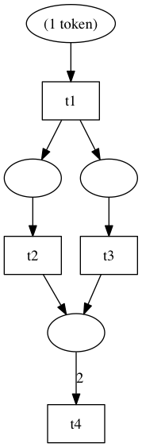
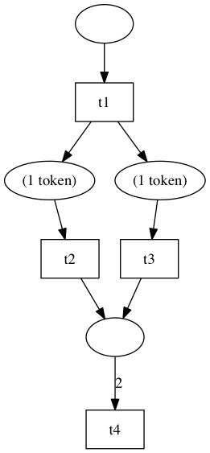
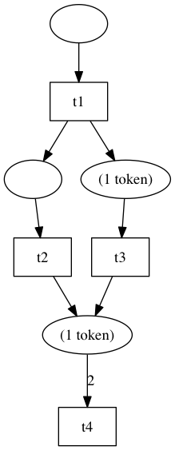
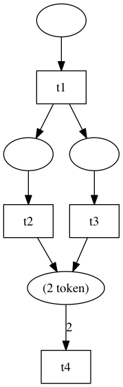

Perti Net
---------

[Perti Net](http://en.wikipedia.org/wiki/Petri_net)

## Getting started

This example will create the following P/T_system: 

### Builder

```php
$builder = new \ziguss\petrinet\PTSystemBuilder();

// places
$p1 = $builder->place(1);
$p2 = $builder->place();
$p3 = $builder->place();
$p4 = $builder->place();

// transitions
$t1 = $builder->transition()->setName('t1');
$t2 = $builder->transition()->setName('t2');
$t3 = $builder->transition()->setName('t3');
$t4 = $builder->transition()->setName('t4');

// connects
$builder->connect($p1, $t1);
$builder->connect($t1, $p2);
$builder->connect($t1, $p3);
$builder->connect($p2, $t2);
$builder->connect($p3, $t3);
$builder->connect($t2, $p4);
$builder->connect($t3, $p4);
$builder->connect($p4, $t4, 2);

// get net system
$net = $builder->getPTSystem();
```

### Fire transition

Let's fire a transition.

```php
// ['t1']
$enabledTransitions = $net->getEnabledTransitions();
$net->fire($enabledTransitions[0]);
```

After fire t1, we got a new marking: 

```php
// ['t2', 't3']
$enabledTransitions = $net->getEnabledTransitions();
$net->fire($t2);
```

After fire t2, we got another new marking: 

```php
// ['t3']
$enabledTransitions = $net->getEnabledTransitions();
$net->fire($enabledTransitions[0]);
```

### Render

#### Graphviz Render

```php
$render = new \ziguss\petrinet\render\Graphviz();
echo $render->render($net);
```

The Graphviz render transforms a net into a string in dot format, so you can write the string in a file:

```php
file_put_contents('petrinet.dot', $string);
```

then

```shell
dot -Tpng petrinet.dot -o 4.png
```

You will obtain this kind of image:



